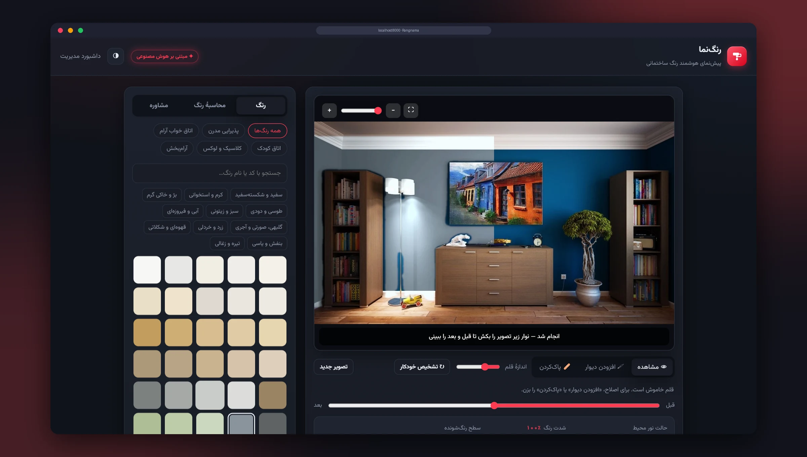
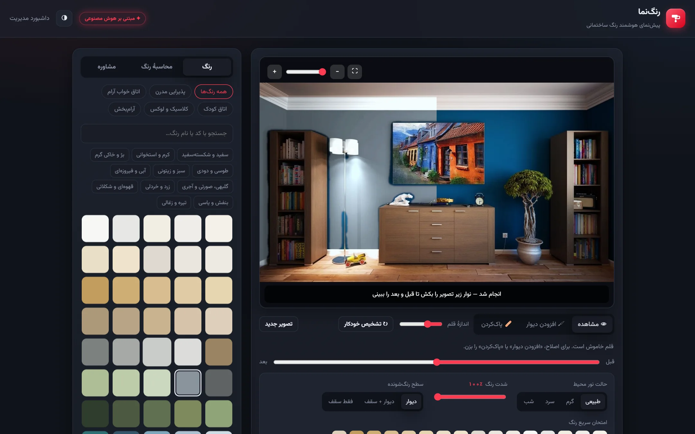
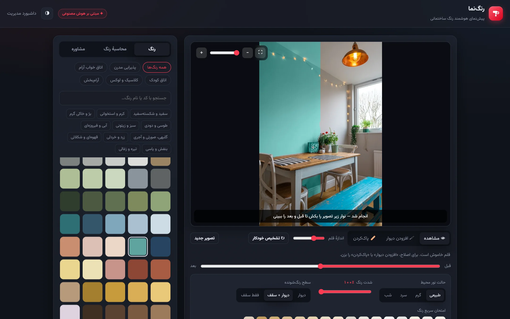
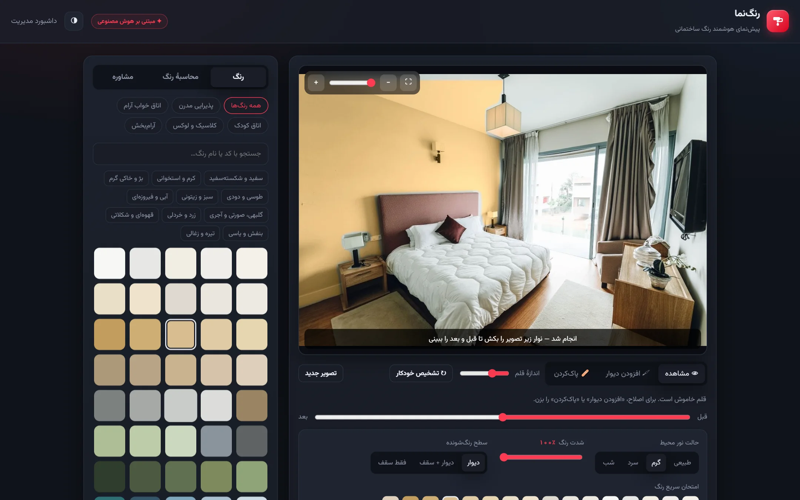
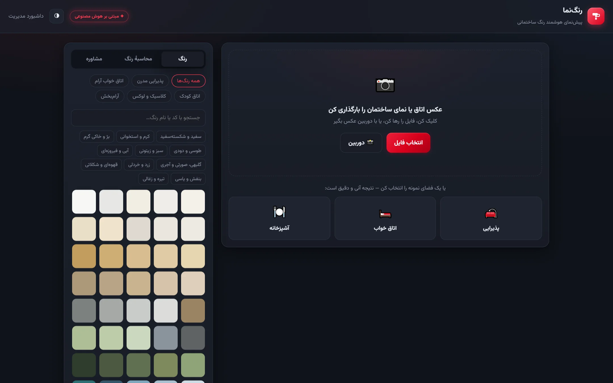
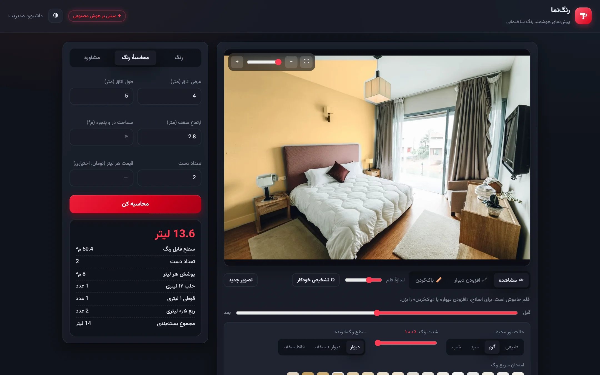
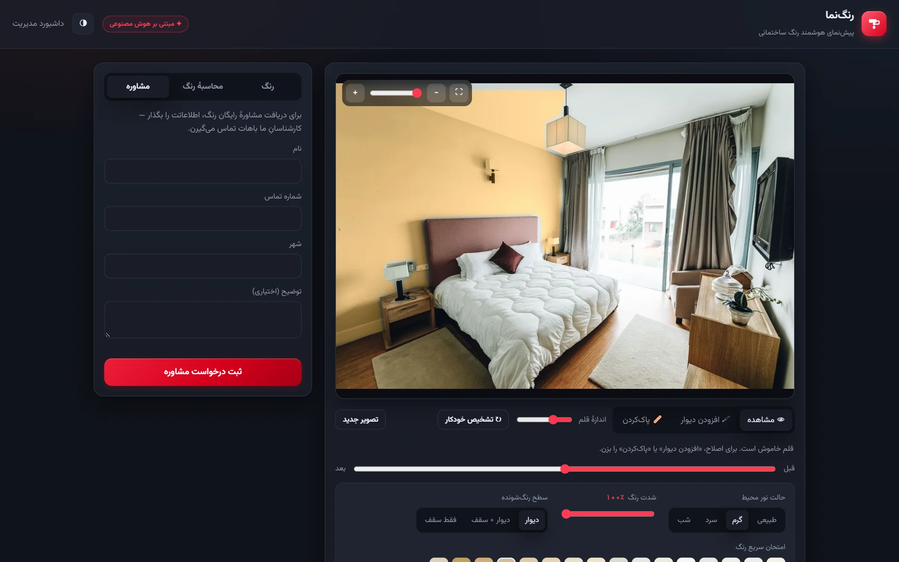
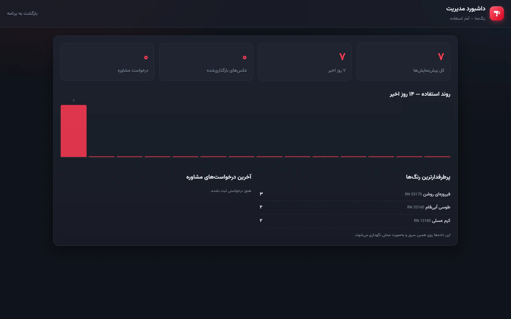
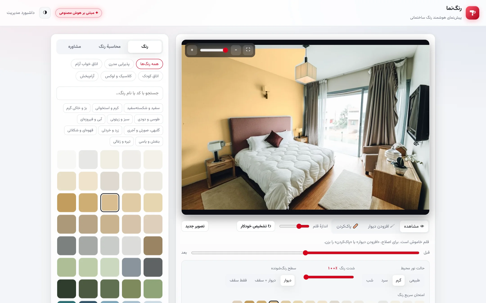
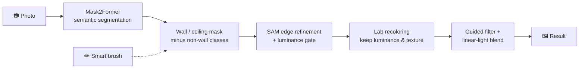

<div align="center">

# 🎨 Rangnama

### AI paint visualizer: one photo, a few seconds, a freshly painted wall

**Upload a photo of a room or facade, pick a color from the catalog, and see the wall repainted, with the photo's real light, shadows and texture preserved.**


<br>



</div>

---

## 📌 Overview

Most paint visualizers either use cartoon-like rooms or pour a flat color over the wall, which wipes out the real lighting and makes the result unconvincing. Customers end up choosing paint from tiny swatches and **guessing**.

Rangnama understands the scene. A semantic segmentation model finds the walls (and ceiling), separates them from furniture, windows, frames and lamps, and a color engine working in **Lab space** recolors only the wall while keeping the photo's luminance, shadows and texture. Everything runs **locally on the seller's server**: no per-image fees, and customers' photos never leave the premises.

> **Result:** customers stop guessing from swatches and see the actual color on their own wall, while the seller gets sales data on which colors are trending.

## ✨ Features

| | |
|---|---|
| 🧠 **Smart wall detection** | Mask2Former (ADE20K) + SAM edge refinement + removal of non-wall classes + luminance gate |
| 🖌️ **Realistic recoloring** | Lab color space, texture/contrast preservation, guided filter on edges, linear-light blending |
| ✏️ **Smart brush** | Click = select the whole region; drag = color-aware brush; changes apply as soon as you release |
| 🏠 **Paintable surface** | Wall · wall + ceiling · ceiling only (molding and cornices are kept) |
| 💡 **Ambient lighting** | Natural · warm · cool · night, plus a color-strength slider (40–100%) |
| ↔️ **Before / after** | Comparison slider on the image, zoom and fullscreen |
| 🖼️ **Sample spaces** | 3 real interior photos with precomputed masks for instant results |
| 🧮 **Paint calculator** | Room size → liters, number of cans and estimated cost |
| 🧾 **Proposal card** | Shareable image with the result, color codes and estimate |
| 📇 **Lead capture** | Consultation request form for sales follow-up |
| 📊 **Admin dashboard** | Usage, most popular colors, 14-day trend and leads (`/admin`) |
| ☁️ **Optional cloud mode** | For hard lighting/angles, recolor with a multimodal cloud model (paid, separate button) |
| 🌗 **Dark / light theme** | Dark by default, with a toggle |

## 📸 Screenshots

### Recoloring

<table>
  <tr>
    <td width="50%"><b>Living room: before / after</b><br></td>
    <td width="50%"><b>Kitchen: wall + ceiling</b><br></td>
  </tr>
  <tr>
    <td><b>Bedroom: warm ambient light</b><br></td>
    <td><b>Start screen: upload a photo or pick a sample space</b><br></td>
  </tr>
</table>

### Sales tools

<table>
  <tr>
    <td width="50%"><b>Paint calculator</b><br></td>
    <td width="50%"><b>Consultation request (lead)</b><br></td>
  </tr>
  <tr>
    <td><b>Admin dashboard</b><br></td>
    <td><b>Light theme</b><br></td>
  </tr>
</table>

## ⚙️ How it works



## 🚀 Getting started

Requirements: **Python 3.10–3.14** and **Git** (a GPU is optional).

**Windows**

```powershell
cd backend
python -m venv .venv
.\.venv\Scripts\python.exe -m pip install -r requirements.txt
.\run.ps1
```

**Linux / macOS**

```bash
cd backend
python3 -m venv .venv
.venv/bin/pip install -r requirements.txt
PYTHONUTF8=1 .venv/bin/python -m uvicorn app.main:app --host 127.0.0.1 --port 8000
```

App: <http://localhost:8000> · Dashboard: <http://localhost:8000/admin>

> - The first run downloads the wall-detection model (Mask2Former, ~800 MB) and the edge model (SAM, ~375 MB); after that it works fully offline.
> - CPU: about 45–60 s per photo. GPU: a few seconds. Sample spaces and brush corrections are always instant.
> - For a weak CPU or a quick demo, use a lighter model: `SEG_MODEL_ID=facebook/mask2former-swin-base-ade-semantic`.
> - For the optional cloud mode, put `OPENAI_API_KEY` in `backend/.env`.

### Docker

```bash
docker compose up --build
```

The model is baked into the image, so it also runs on servers without internet access.

## 🔌 API

| Endpoint | Purpose |
|---|---|
| `GET /api/catalog` | Color catalog: families, collections, products, colors |
| `POST /api/mask` | Surface detection → PNG mask; `part` = `wall` \| `ceiling` \| `wall_ceiling`; `x,y` for a single region |
| `POST /api/visualize` | Photo + color code (+ mask, `lighting`, `strength`) → JPEG |
| `POST /api/visualize-ai` | Photo + color code → JPEG (cloud mode) |
| `POST /api/visualize-multi` | Several surfaces with different colors (JSON) |
| `POST /api/estimate` | Room dimensions → paint quantity |
| `POST /api/lead` | Submit a consultation request |
| `GET /api/stats` | Dashboard statistics |

## 📁 Project structure

```text
backend/app/
  main.py           API + serves the frontend
  segmentation.py   surface detection (Mask2Former / SegFormer) + surface_mask
  sam_refine.py     precise mask edges with SAM
  recolor.py        Lab recoloring engine
  cloud_recolor.py  optional cloud recoloring
  mask_utils.py     mask cleanup and edge refinement
  calc.py           paint calculator
  db.py             statistics and leads (SQLite)
  palette.py        color catalog
backend/tools/gen_scene_masks.py   regenerate sample spaces and their masks
frontend/
  index.html  style.css  app.js    main app
  admin.html  admin.js             dashboard
  scenes/                          sample photos + precomputed masks (3 surface modes)
Dockerfile  docker-compose.yml  ARCHITECTURE.md
```

## 📄 Models, data and license

- Wall detection: `facebook/mask2former-swin-large-ade-semantic` (Mask2Former family, suitable for commercial use).
- Edge refinement: `facebook/segment-anything` (SAM ViT-B, Apache-2.0).
- Sample-space photos: Pexels (free for commercial use); see [`frontend/scenes/CREDITS.md`](frontend/scenes/CREDITS.md).
- `backend/data/palette.json` is a 68-color **sample** catalog with approximate HEX values; replace it with real spectrophotometer data before production.

© 2026 Erfan Mohammadi. All rights reserved.

## 🗺️ Roadmap

- [ ] Real product catalog (codes + spectrophotometer Lab values)
- [ ] Authentication for the admin dashboard and `/api/stats`
- [ ] Automatic notification of new leads (email / Telegram)
- [ ] Admin panel to add colors and sample spaces without code changes
- [ ] Embeddable widget (`<iframe>`) for seller websites
- [ ] In-browser lightweight version (transformers.js) to remove server load

## 👨‍💻 Author

**Erfan Mohammadi**

[](https://erfanmohammadi.ir/)
[](https://www.linkedin.com/in/erfan-mohammadi77/)
[](https://github.com/erfanmohammadi1998)

---

<div dir="rtl">

## 🇮🇷 خلاصه فارسی

**رنگ‌نما: پیش‌نمای هوشمند رنگ ساختمانی با هوش مصنوعی.** مشتری یک عکس از اتاق یا نمای ساختمان می‌گذارد (یا یکی از فضاهای نمونه را انتخاب می‌کند)؛ هوش مصنوعی دیوارها را تشخیص می‌دهد و در چند ثانیه آن‌ها را با رنگ انتخابی از کاتالوگ رنگ می‌کند، با حفظ کامل نور، سایه و بافت واقعی عکس.

- تشخیص هوشمند دیوار و سقف (Mask2Former + SAM) و رنگ‌آمیزی واقع‌گرایانه در فضای Lab
- قلم هوشمند، مقایسهٔ قبل و بعد، حالت‌های نور محیط و شدت رنگ
- ماشین‌حساب رنگ، کارت پیشنهاد، فرم ثبت لید و داشبورد مدیریت
- پردازش کاملاً لوکال روی سرور فروشنده؛ بدون هزینهٔ هر تصویر و بدون خروج عکس مشتری

</div>
